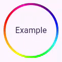

<!--
This README describes the package. If you publish this package to pub.dev,
this README's contents appear on the landing page for your package.

For information about how to write a good package README, see the guide for
[writing package pages](https://dart.dev/guides/libraries/writing-package-pages).

For general information about developing packages, see the Dart guide for
[creating packages](https://dart.dev/guides/libraries/create-library-packages)
and the Flutter guide for
[developing packages and plugins](https://flutter.dev/developing-packages).
-->

Library to create colorful loading indicator

The current state is under active development but is considered stable.

I recommend to take a look at the [example project](https://colorful-loading-indicator.memeozer.com)

## Features

- FixedGradientProgressIndicator (also as Circular and Linear)
- MovingGradientProgressIndicator (also as Circular and Linear)

## Getting started

```terminal
dart pub add colorful_progress_indicator
```

## Usage

(see /example folder for a working example and different use cases)

```dart

```

```dart
CircularMovingGradientProgressIndicator(
    progress: null,
    thickness: EdgeInsets.all(2),
    colors: GradientColors.razerChroma,
    child: CircleAvatar(
        backgroundColor: Colors.transparent,
        radius: 50,
        child: Text("Example"),
    ),
);
```


## Additional information

My personal main goal was to recreate the Chroma spinner animation of [Razer](https://www.razer.com)
While this package achieves this goal, it has no RazerChromaIndicator widget kind of stuff.

I am currently looking for ways implementing the current effects with custom render objects to let the animations be fluid around any boxed child.
